# Научно-исследовательская работа
Моя научно-исследовательская работа (курсовая работа) была выполнена на тему: "Классификация рентгеновских снимков с помощью сверточных нейронных сетей для выявления солитарного легочного узла". Работа была выполнена студентом Национального исследовательского Томского государственного университета группы 932101 Зайнулиным Владиславом под руководством [Евгения Владимировича Пестова](https://github.com/pestoffne).

# Солитарный легочный узел
Солитарный легочный узел (СЛУ) или Nodule представляет собой одиночное округлое или овальное образование в легких, размер которого, как правило, не превышает 3 см в диаметре. Эти узлы могут быть случайно обнаружены на рентгеновских снимках или компьютерной томографии (КТ) грудной клетки, проведенных по другим причинам. СЛУ могут иметь различное происхождение и природу, что делает их диагностику и дальнейшее лечение важной и сложной задачей.

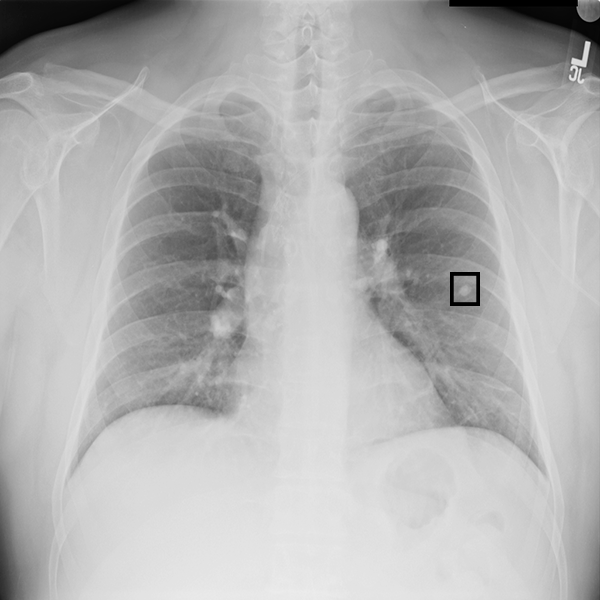

# Анализ схожих работ
[Выпускная квалификационная работа бакалавра Афины Юрьевны Подерни](https://vital.lib.tsu.ru/vital/access/manager/Repository/vital:16128), выполненная в Томском государственном университете и опубликованная в 2022 году, посвящена разработке модуля классификации для системы поддержки принятия решений при анализе патологий на рентгеновских снимках грудной клетки. В данной работе использовался датасет [NIH Chest X-rays](https://www.kaggle.com/datasets/nih-chest-xrays/data), который содержит большое количество рентгеновских изображений различных патологий легких. Основной акцент в работе был сделан на теоретический анализ различных архитектур нейронных сетей. В ходе исследования было выявлено, что наиболее эффективной архитектурой для классификации рентгеновских снимков грудной клетки является [DenseNet121](https://arxiv.org/pdf/1608.06993v5).

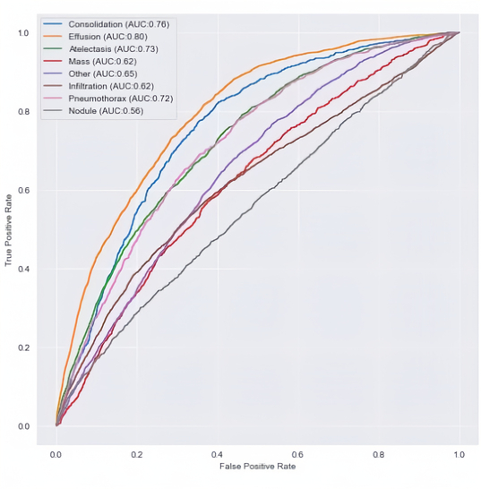

Проект под названием ["NIH-Chest-X-rays-Classification"](https://github.com/paloukari/NIH-Chest-X-rays-Classification), разработанный Спиросом Гарифаллосом, Брентом Биседой и Мумином Кханом, представляет собой ещё один значимый вклад в область классификации рентгеновских снимков грудной клетки с использованием моделей глубокого обучения. В данной работе также использовался датасет [NIH Chest X-rays](https://www.kaggle.com/datasets/nih-chest-xrays/data). Авторы проекта провели тщательный перебор гиперпараметров, что позволило им оптимизировать производительность модели, кроме того, была проведена оценка различных архитектур моделей. Одним из значимых экспериментов было использование слоя внимания, который позволил модели фокусироваться на наиболее значимых областях изображения.

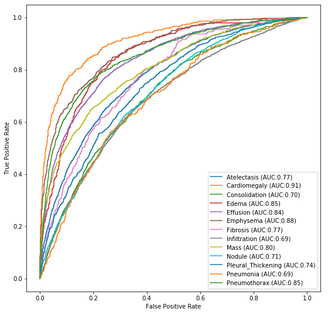

# Данные для обучения
После изучения схожих работ, было решено использовать датасет [NIH Chest X-rays](https://www.kaggle.com/datasets/nih-chest-xrays/data), как и в других исследованиях. Датасет NIH Chest X-rays представляет собой один из самых больших общедоступных наборов данных рентгеновских снимков грудной клетки. Этот датасет был составлен Национальными институтами здравоохранения (National Institutes of Health). В датасете содержится 112 120 рентгеновских снимков от 30 805 уникальных пациентов. Около половины снимков относятся к здоровым людям и имеют метку "No Finding". Остальные снимки отображают 14 различных классов заболеваний, при этом классы могут пересекаться, что означает, что у одного человека могут быть обнаружены несколько заболеваний одновременно.

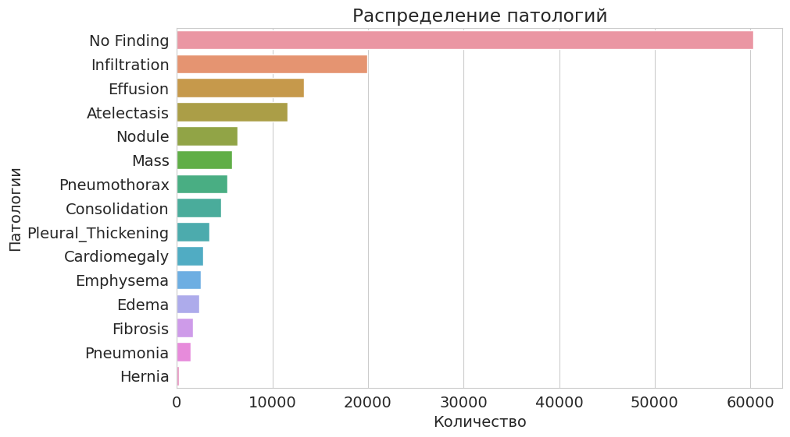

## Ошибки в метках
Категории заболеваний были извлечены из соответствующих радиологических отчетов с использованием техник обработки естественного языка. Авторы использовали методы обработки естественного языка (NLP) для извлечения классификаций заболеваний из связанных с ними радиологических отчетов. Несмотря на высокую заявленную точность (более 90%), некоторые неточности могут существенно влиять на результаты анализа и диагностики. Одной из ключевых проблем является наличие ошибок в метках, что может приводить к неверной интерпретации данных и, следовательно, к неправильным выводам.

В качестве примера можно рассмотреть следующие снимки: Слева снимок 00000021_000.png, для данного снимка была назначена метка "Nodule". Справа снимок 00000021_001.png, несмотря на наличие патологии, метка "Nodule" отсутствует. В прямоугольники выделено положение патологии. Этот пример иллюстрирует, что несмотря на наличие патологии на обоих снимках, метка "Nodule" была назначена только для одного из них. Таким образом, ошибки в разметке могут вводить модель в заблуждение, что снижает её эффективность.

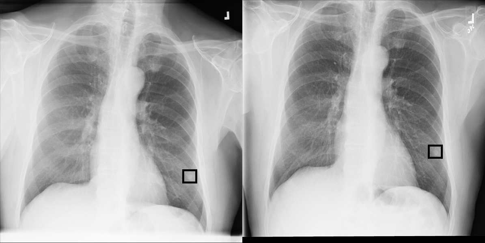

## Мусорные данные
В процессе анализа были обнаружены “мусорные” данные. Наличие таких данных может существенно снижать качество анализа и мешать построению точных диагностических моделей. Основные типы “мусорных” данных, которые были обнаружены в датасете:
1.	Снимки лёгких детей
2.	Снимки плохого качества
3.	Снимки вида сбоку (латеральные снимки)
4.	Инвертированные снимки
5.	Снимки не лёгких или ниже них

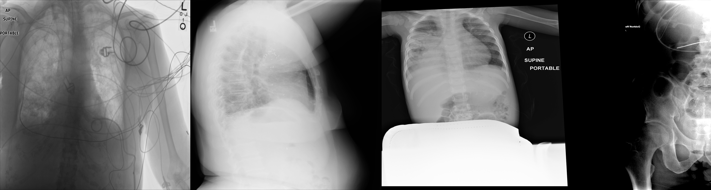

## Несбалансированность количества снимков у пациентов
В датасете наблюдается значительная несбалансированность в количестве снимков у разных пациентов. Для одного пациента может быть от 1 до 184 снимков. Такая несбалансированность может негативно влиять на обучение и результаты модели, ибо модель может переобучиться на пациентах с большим количеством снимков, так как будет стараться запомнить все детали этих снимков, а не выучить общие закономерности. Это приводит к снижению способности модели справляться с новыми и неизвестными данными.

## Необходимость объединения Nodule и Mass в один класс
На рентгеновском снимке 00001688_000.png, который предполагается имеет узел (Nodule), координаты Bbox, указывающие его расположение, имеют аномально большие значения в сантиметрах: 20.57 см по ширине и 25.30 см по высоте. Такие значения явно не соответствуют типичным размерам узлов, которые обычно составляют от нескольких миллиметров до нескольких сантиметров в диаметре, такие размеры могут соответствовать Mass. Также, рассмотрев другие датасеты, мы обнаружили, что в некоторых из них, таких как [VinDr-CXR](https://vindr.ai/datasets/cxr), классы Nodule и Mass не разделены и представлены единым классом. Учитывая все данные факты, было решено объединить Nodule и Mass в один класс Nodule/Mass для обучения модели.

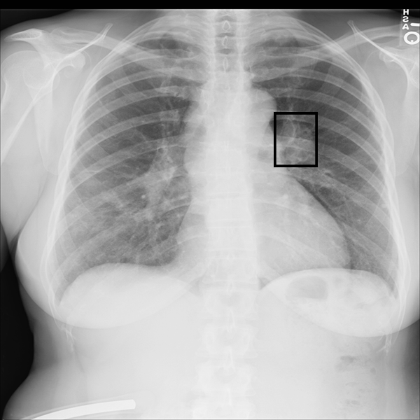

# Особенности реализации
## Предобработка данных
- Разделение выборок по пациентам является ключевым этапом в предобработке данных, направленным на улучшение обобщающей способности модели. В нашем проекте изображения были распределены таким образом, чтобы для каждого пациента использовалось только одно изображение, и снимки одного пациента не пересекались между обучающей и тестовой выборками.
- Для улучшения устойчивости модели к различным вариациям изображений была применена аугментация для тренировочных данных. Включение методов аугментации помогло избежать переобучения модели на наборе данных.
- Для обеспечения качества данных и повышения точности модели производится удаление “мусорных” изображений. Это улучшает качество обучающего набора и позволяет модели обучаться на более чистых и информативных данных.

## Техническая реализация
Для нашей задачи классификации рентгеновских снимков была выбрана предобученная модель DenseNet121. Архитектура модели включала следующие компоненты:
1.	Базовая модель: DenseNet121 без верхних слоёв, с предобученными весами.
2.	Средний слой: Глобальный средний пуллинг для уменьшения размерности признаков.
3.	Слой внимания: В процессе работы было принято решение использовать плотный слой с активацией ReLU для извлечения важных признаков, а затем плотный слой с активацией сигмоида для создания маски внимания, которая применяется к признакам. Хотя в проекте "NIH-Chest-X-rays-Classification" на GitHub использовался другой слой внимания, мы увидели, что этот подход помогает улучшить качество классификации, поэтому разработали свой слой внимания на основе ReLU и сигмоида.
4.	Выходной слой: Плотный слой с активацией сигмоида для получения вероятности класса.

Гиперпараметры модели были определены исходя из результатов экспериментов, проведенных в проекте "NIH-Chest-X-rays-Classification" на GitHub. Выбор оптимальных гиперпараметров включал:
- Размер изображений: 224x224 пикселя
- Размер батча: 32
- Скорость обучения: 0.0001
- Оптимизатор: Adam

Для управления процессом обучения и улучшения модели применялись обратные вызовы ReduceLROnPlateau, ModelCheckpoint, EarlyStopping.

## Анализ результатов

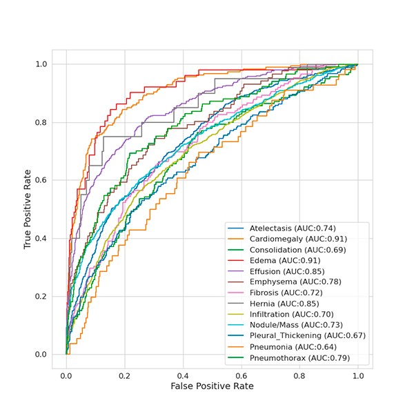

После анализа результатов, полученных с использованием нашего подхода, мы пришли к выводу, что, несмотря на исправление ошибок предыдущих исследований, улучшение результатов не было столь значительным, как ожидалось. Это наблюдение подтолкнуло нас к дальнейшему изучению влияния качества размеченных данных на конечный результат. Мы предполагаем, что даже мелкие неточности в данных могут существенно сказаться на эффективности и точности моделей.

## Исследование влияния качества данных
Для исследования зависимости результата от качества данных были взяты следующие датасеты:
- [NODE21](https://zenodo.org/records/5548363) - Этот набор данных состоит из фронтальных рентгенограмм грудной клетки с аннотированными рамками вокруг узелков.
- [XRay Chest Nodule](https://universe.roboflow.com/xray-chest-nodule/cxr-dcjlk) - Этот набор данных представляет собой часть изображений из NIH Chest X-rays, а именно 2015 изображений, которые содержат патологию Nodule.

Данные наборы данных были выбраны по причине их высокой точности разметки, выполненной профессиональными рентгенологами. Это позволяет нам быть уверенными в присутствии или отсутствии патологии на изображениях и служит надежной основой для проверки нашей гипотезы.

Применив наш подход, мы провели сравнение моделей, обученных на исходном датасете (NIH Chest X-rays) и на правильно размеченных данных (NODE21 и XRay Chest Nodule). Для оценки эффективности моделей использовались одинаковые тестовые наборы данных. Из полученных результатов явно видно, что модель, обученная на верно размеченных данных, показывает значительно более высокие результаты по сравнению с моделью, обученной на исходных данных.

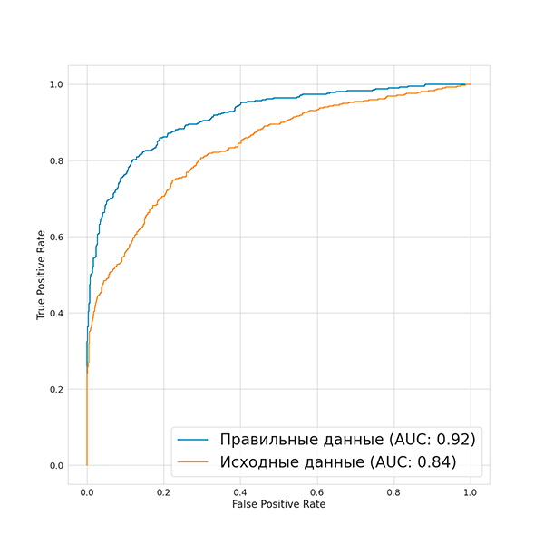

## Grad-CAM
Для того чтобы лучше понять, как нейронная сеть принимает свои решения и какие части изображения являются наиболее значимыми для ее предсказаний, было решено использовать метод [Grad-CAM (Gradient-weighted Class Activation Mapping)](https://keras.io/examples/vision/grad_cam/). В ходе анализа визуализаций, полученных с помощью Grad-CAM, было замечено, что значимые активации модели присутствуют не только в областях патологии, но и на фоне, а также на костях рук и шеи. Такое распределение активаций может отрицательно влиять на точность предсказаний. Для решения этой проблемы было принято решение применить сегментацию, чтобы исключить влияние фоновых и незначимых областей на результат работы модели.

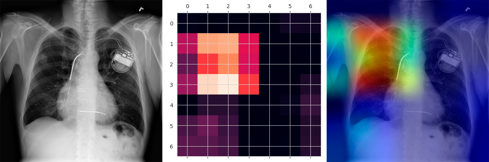

В результате анализа данных было выявлено, что патология может располагаться в различных частях снимка, включая область лёгких, тень от сердца и тень от диафрагмы. Учитывая это, было решено, что для более точного обнаружения патологий необходимо сегментировать не только лёгкие, но и сердце, а также диафрагму. Такой подход позволит улучшить локализацию значимых областей и повысить точность предсказаний модели.

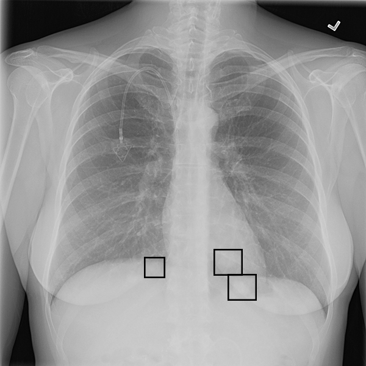

## Сегментация данных
Для автоматизации процесса сегментации данных было решено использовать нейросетевой подход. При проведении исследования были найдены следующие датасеты, содержащие рентгеновские снимки и соответствующие бинарные маски для сегментации лёгких:
1.	[Данные Шэньчжэня](https://www.kaggle.com/datasets/nikhilpandey360/chest-xray-masks-and-labels)
2.	[Данные Монтгомери](https://www.kaggle.com/datasets/nikhilpandey360/chest-xray-masks-and-labels)
3.	[Данные JSRT](https://db.jsrt.or.jp/eng.php)
4.	[Данные RSNA](https://github.com/limingwu8/Lung-Segmentation?tab=readme-ov-file)

Бинарные маски, содержащиеся в этих наборах данных, были адаптированы таким образом, чтобы модель могла сегментировать не только лёгкие, но и тень от сердца.

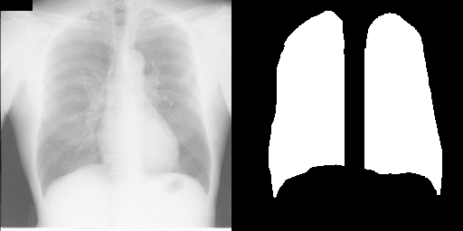

Для решения задачи сегментации медицинских изображений была выбрана модель [Unet](https://en.wikipedia.org/wiki/U-Net ). Эта модель широко применяется в области медицинского компьютерного зрения благодаря своей способности точно выделять объекты на изображениях. Для получения итогового сегментированного изображения процесс обработки включает следующие этапы:
1.	Нормализация гистограммы ([CLAHE](https://docs.opencv.org/4.x/d5/daf/tutorial_py_histogram_equalization.html))
2.	Предсказание сегментированных лёгких и сердца
3.	[Удаление ненужных артефактов](https://scikit-image.org/docs/stable/api/skimage.morphology.html)
4.	Определение и сохранение местоположения позвоночника
5.	Применение операции [dilate](https://docs.opencv.org/4.x/d9/d61/tutorial_py_morphological_ops.html )
6.	Расширение маски вниз
7.	Удаление позвоночника с маски

Таким образом, после выполнения всех вышеописанных этапов получается итоговое сегментированное изображение, которое точно выделяет области лёгких и сердца, включая расширенную область диафрагмы, с учетом удаления позвоночника для более точной и полной сегментации на медицинском изображении.

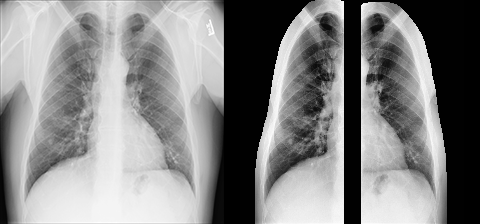

Было проведено несколько экспериментов с различными подходами к обучению модели:
1.	Обучение только на сегментированных данных
2.	Обучение только на обычных снимках
3.	Обучение на сегментированных и обычных снимках

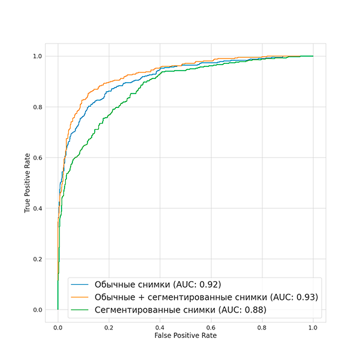

По результатам видно, что модель, обученная на комбинации обычных и сегментированных снимков, показывает лучшие результаты среди всех, достигая значения AUC 0.93. Однако, стоит отметить, что разница между этой моделью и моделью, обученной только на обычных снимках, не является значительной, поскольку последняя достигает AUC 0.92.

Поэтому было решено проверить, сместилась ли активация в большую сторону патологии. По итогу было получено, что модель, обученная при комбинации данных, показала, что в 67% случаев активация в области патологии увеличилась или не изменилась по сравнению с моделью, обученной на обычных данных. Это свидетельствует о том, что использование сегментированных данных в сочетании с обычными изображениями может способствовать улучшению способности модели выделять и фокусировать активацию в областях патологии.

# Результат
В результате проведенного исследования была разработана модель свёрточной нейронной сети, способная эффективно классифицировать рентгеновские снимки легких и выявлять присутствие солитарных легочных узлов. Данная модель продемонстрировала высокие показатели с ROC-AUC равным 0.93, что подтверждает её возможную пригодность для использования в клинической практике.

Одним из ключевых достижений работы стало улучшение результатов за счёт применения методов сегментации, что позволило более точно определять области интереса на рентгеновских снимках.

Кроме того, данная работа превосходит аналогичные исследования благодаря исправлению ошибок и недочётов, выявленных в предыдущих работах. Были учтены особенности наборов данных и проведена тщательная предобработка, что улучшило качество данных и, соответственно, результаты модели.

